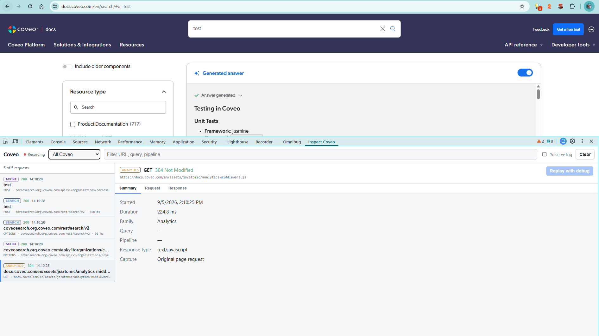
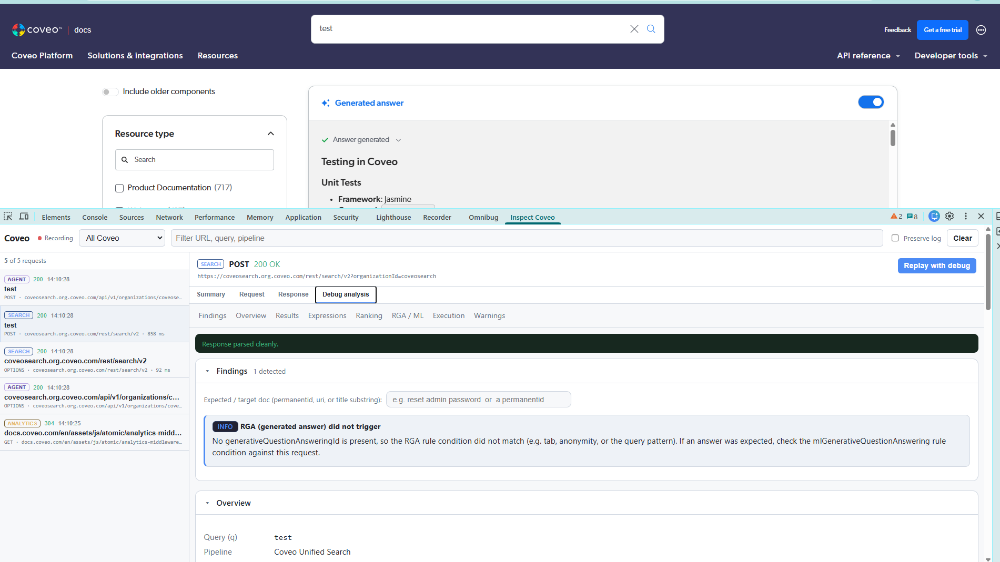
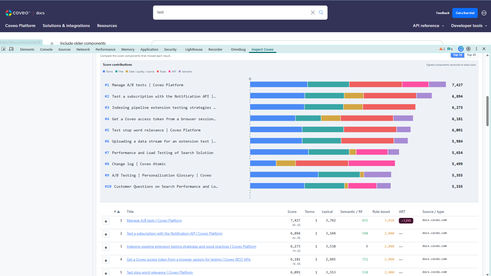

# Debug Inspector for Coveo

A **fully client-side** tool for debugging Coveo search queries from a captured
`debug:true` search response — without replaying the query.

It ships as a web app and as a Chrome DevTools extension that lists Coveo API
traffic, analyses Search responses and generative answer streams, and can
deliberately replay a Search request with `debug: true`.

## Why

Coveo's built-in Query Inspector *replays* a query, so it runs under the **tool
user's** identity and permissions rather than the **original searcher's**. When
you are debugging a real user issue — a missing document, no generated answer,
permission-scoped filters — a replay gives misleading results.

A captured debug response already contains everything that happened under the
*original* user's permissions:

- the fully expanded query expressions (`basicExpression`, partial-match atoms,
  stop words, `advanced`/`constant`/`disjunction` filter trees),
- every applied filter,
- the timed `executionReport` pipeline stages,
- per-result ranking breakdown (`rankingInfo`, including the decoded **semantic
  encoder** function with its `min_cosine` gate and ranking modifiers),
- results with `absentTerms`, scores and metadata,
- `warnings` and the generative answer (`generativeQuestionAnsweringId`) trigger.

This tool parses all of that into a readable, diagnostic view and runs a
heuristics engine that flags common failure modes.

## Screenshots

Every Coveo call the page makes is listed and classified, with the request and
response available without leaving DevTools.



Search responses get the full inspector, and a search can be re-issued with
`debug: true` when the page did not ask for ranking detail.



Each result's score is decomposed into the components that produced it, so a
document boosted by click behaviour is distinguishable from one that earned its
position on relevance.



## Privacy

- **Nothing leaves your browser.** The web app makes **no network calls** and
  never replays the query.
- Any `Authorization` header in a pasted curl command is **stripped on ingest**.
- The extension redacts authorization, cookie and API-key values — in headers
  and in URL query strings — before data reaches the panel.
- The extension manifest declares no `permissions`, no `host_permissions` and no
  content scripts. See [The install permission warning](#the-install-permission-warning).
- No persistence by default; reload clears everything.

## Usage

```bash
npm install
npm run dev      # local dev server
npm run build    # typecheck + production build to dist/
npm run preview  # serve the production build
npm test         # run parser, heuristics and extension tests
```

Open the app, then **paste or drop**:

1. the **debug response JSON** (required), and
2. the **request curl / body** (optional — adds `q`, pipeline and genQA config,
   and enables `Authorization` redaction).

Click **Analyze**. Optionally enter an **expected / target doc** (a
`permanentid`, `uri`, or a title substring) to enable targeted checks such as
"my document is in the results but below the semantic gate".

## Chrome DevTools extension

```bash
npm run build:extension
```

1. Open `chrome://extensions` and enable **Developer mode**.
2. Choose **Load unpacked** and select `dist-extension/`.
3. Open DevTools before loading or reloading a Coveo-powered page.
4. Open the **Inspect Coveo** panel.

The panel records Coveo REST calls while DevTools is open, classifying Search,
query suggestions, analytics, recommendations, generative answer streams, the
Answer API and the Agent API. Search responses expose the full inspector;
generative streams expose an Answer view; other families expose their sanitised
request and response payloads. The log keeps the latest 250 requests and clears
on navigation unless **Preserve log** is enabled.

Requests completed before the listener starts may appear through HAR backfill
without a response body. Reload the inspected page to capture complete bodies.

Coveo endpoints proxied through a site's own origin — for example a Salesforce
managed package — are detected by a literal `coveo` path segment.

### The install permission warning

Chrome warns that the extension can **read and change your data on the websites
you visit**. That warning comes from the `devtools_page` manifest key on its
own: declaring it makes Chromium grant the extension an implicit `devtools`
permission, which Chrome reports as a host permission because a DevTools panel
can evaluate code in any page you inspect.

The manifest requests no `permissions` and no `host_permissions`, and ships no
content script. The panel only ever sees traffic from the tab whose DevTools you
have open, and only while that DevTools window is open.

### Packaging for the Chrome Web Store

```bash
npm run package:extension
```

This builds the extension and writes `debug-inspector-for-coveo-<version>.zip`,
containing the *contents* of `dist-extension/` so that `manifest.json` sits at
the archive root — the store rejects a package whose manifest is nested inside a
folder. The store also requires the version in `extension/public/manifest.json`
to increase on every upload.

Listing screenshots live in `store-assets/`, cropped to the 1280x800 the store
demands. Regenerate them after replacing anything in `public/screenshots/`:

```bash
python3 scripts/store-screenshots.py
```

The store accepts only 1280x800 or 640x400 and requires full bleed, so the
script crops rather than pads. Pillow is needed locally but is not a project
dependency.

### If no requests appear

Browser extensions that intercept or mock network traffic install their own
`fetch`/`XMLHttpRequest` wrappers in the page. Traffic they handle can bypass
`chrome.devtools.network` entirely, so the panel stays empty even though the page
is clearly issuing Coveo calls. Disable those extensions for the inspected
origin and reload. The same interception can swallow a debug replay.

The panel detects this: if `window.fetch` or `XMLHttpRequest` has been replaced
on the inspected page, a warning appears above the request list.

### Debug replay

**Replay with debug** is available for `POST` Search requests, whether the body
is JSON or form-encoded. It clones the captured URL, method, body and
replay-safe headers, sets `debug` to `true`, executes through the inspected
page, and captures the result as a separate request labelled **Replay**.

The original capture is never replaced. A replay uses the inspected page's
current credentials, so it is not historical evidence of what the original user
received.

## Generative answers

Generative streams are parsed into a single view covering both the Search API
RGA stream and the Agent API:

- the reassembled answer text and its content format,
- citations with their permanent IDs, sources, any fields requested through
  `citationsFieldToInclude`, and the **passage the model actually saw**,
- for agentic runs, each step with its duration and the query the agent rewrote
  and searched for,
- a warning when a stream completes without generating an answer.

## What it detects

The heuristics engine (`src/analysis/heuristics.ts`) flags:

- **Loose partial match** — a low `match=%` threshold lets intent terms land in
  `absentTerms`.
- **Semantic-gate starvation** — an expected document is present lexically but
  has `Ranking functions: 0`, so its cosine similarity is below `min_cosine` and
  it is invisible to generative grounding.
- **Folding misconfiguration** — a `filterField` warning from the API.
- **Generative trigger and grounding** — an answer was requested but the expected
  passages sit below the gate.
- **API warnings** — surfaced verbatim.

## Deployment

`.github/workflows/pages.yml` type-checks, tests and builds on every push to
`main`, then publishes `dist/` to GitHub Pages. The site is a three-page build:
a landing page at the root, the app at `/app/`, and the privacy policy at
`/privacy/`. The `base` in `vite.config.ts` must match the Pages path.

## Licence

Licensed under the Apache License, Version 2.0. See [LICENSE](LICENSE) and
[NOTICE](NOTICE).

## Affiliation

Not affiliated with, endorsed by, or sponsored by Coveo Solutions Inc. "Coveo"
is a trademark of its respective owner and is used here only to describe what
this tool inspects.
